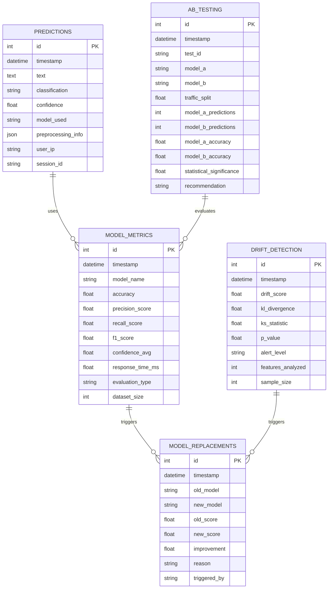

# 🗄️ Diagrama Entidad-Relación - Hate Speech Detector

## 📊 **DIAGRAMA ER**



## 🏗️ **NORMALIZACIÓN DE DATOS**

### **1NF (Primera Forma Normal)**
- ✅ Todos los atributos son atómicos
- ✅ No hay grupos repetitivos
- ✅ Cada tabla tiene una clave primaria

### **2NF (Segunda Forma Normal)**
- ✅ Cumple 1NF
- ✅ No hay dependencias parciales
- ✅ Todos los atributos no clave dependen completamente de la clave primaria

### **3NF (Tercera Forma Normal)**
- ✅ Cumple 2NF
- ✅ No hay dependencias transitivas
- ✅ Los atributos no clave no dependen de otros atributos no clave

## 📋 **DESCRIPCIÓN DE ENTIDADES**

### **PREDICTIONS**
- **Propósito**: Almacena todas las predicciones realizadas por el sistema
- **Clave primaria**: `id` (autoincremental)
- **Relaciones**: Referencia a modelos a través de `model_used`

### **MODEL_METRICS**
- **Propósito**: Almacena métricas de rendimiento de cada modelo
- **Clave primaria**: `id` (autoincremental)
- **Relaciones**: Un modelo puede tener múltiples evaluaciones

### **MODEL_REPLACEMENTS**
- **Propósito**: Registra el historial de reemplazos automáticos de modelos
- **Clave primaria**: `id` (autoincremental)
- **Relaciones**: Referencia a modelos antiguos y nuevos

### **DRIFT_DETECTION**
- **Propósito**: Almacena resultados de detección de drift en los datos
- **Clave primaria**: `id` (autoincremental)
- **Relaciones**: Puede triggerar reemplazos de modelos

### **AB_TESTING**
- **Propósito**: Registra experimentos A/B entre modelos
- **Clave primaria**: `id` (autoincremental)
- **Relaciones**: Evalúa rendimiento de modelos

## 🔗 **RELACIONES**

1. **PREDICTIONS → MODEL_METRICS**: Un modelo puede tener múltiples predicciones y métricas
2. **MODEL_METRICS → MODEL_REPLACEMENTS**: Las métricas pueden triggerar reemplazos
3. **DRIFT_DETECTION → MODEL_REPLACEMENTS**: El drift puede triggerar reemplazos
4. **AB_TESTING → MODEL_METRICS**: Los tests A/B evalúan métricas de modelos

## 📊 **ÍNDICES RECOMENDADOS**

```sql
-- Índices para optimizar consultas frecuentes
CREATE INDEX idx_predictions_timestamp ON predictions(timestamp);
CREATE INDEX idx_predictions_classification ON predictions(classification);
CREATE INDEX idx_model_metrics_model_name ON model_metrics(model_name);
CREATE INDEX idx_model_metrics_timestamp ON model_metrics(timestamp);
CREATE INDEX idx_drift_detection_timestamp ON drift_detection(timestamp);
CREATE INDEX idx_ab_testing_test_id ON ab_testing(test_id);
```

## 🎯 **VENTAJAS DEL DISEÑO**

- **✅ Escalabilidad**: Diseño normalizado para grandes volúmenes
- **✅ Flexibilidad**: Fácil agregar nuevos campos
- **✅ Integridad**: Claves foráneas y restricciones
- **✅ Performance**: Índices optimizados
- **✅ Auditoría**: Timestamps en todas las tablas
- **✅ MLOps**: Soporte completo para monitoreo y reemplazo automático
